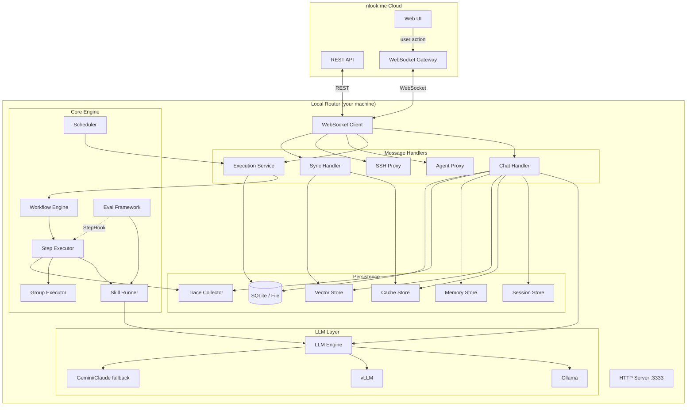
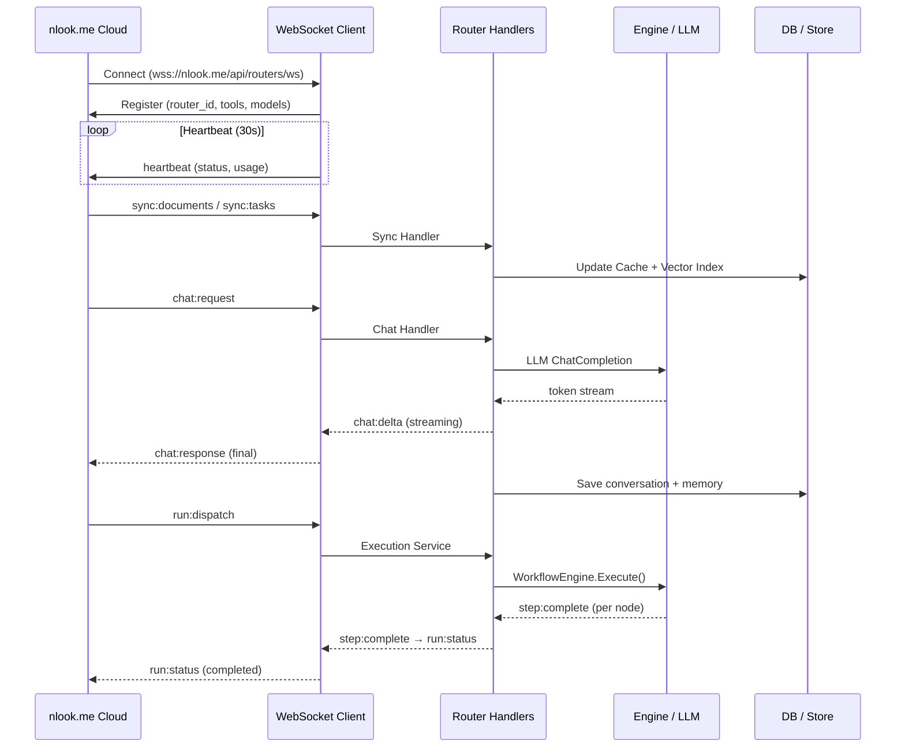
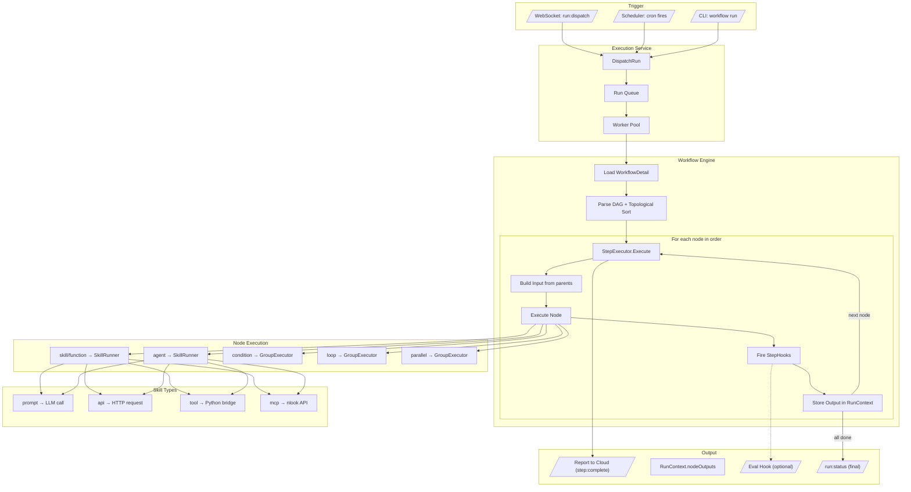
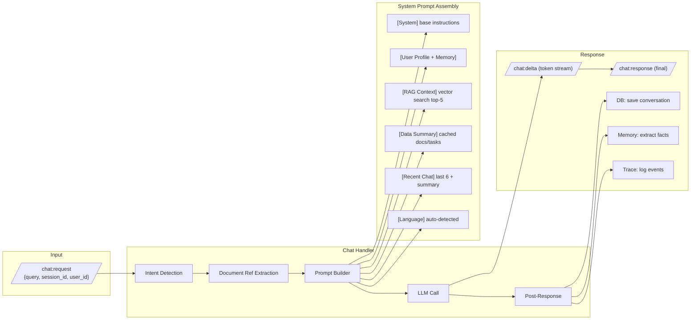
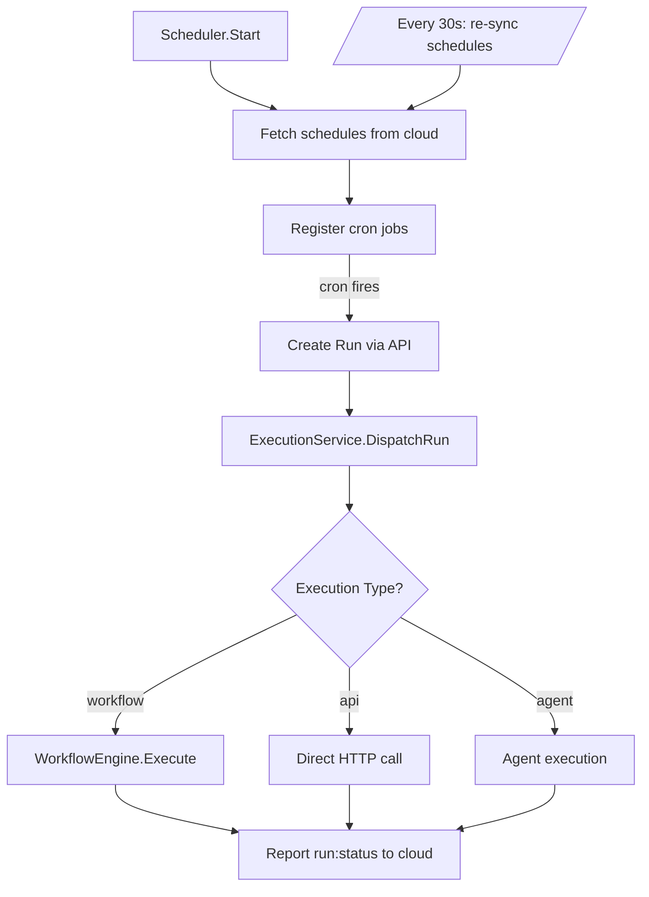
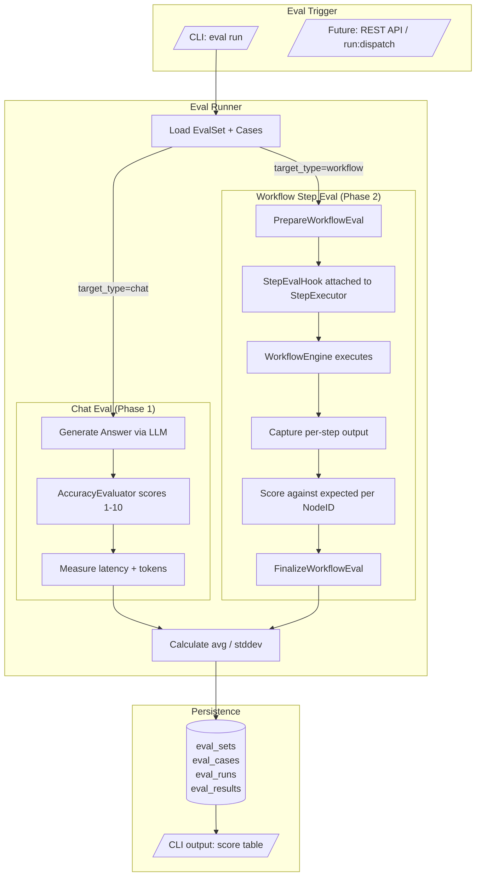
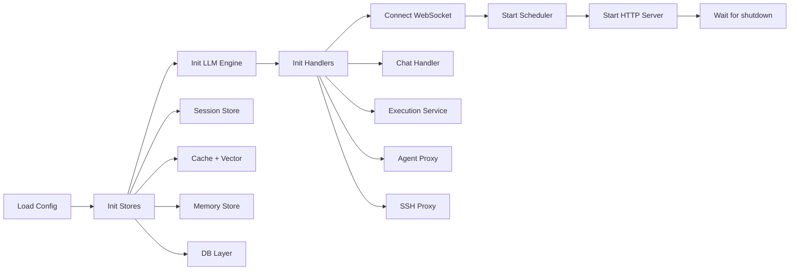

# nlook Router

Local execution engine for [nlook.me](https://nlook.me) — runs workflows, AI chat, agent terminals, and scheduled jobs on your machine.

## Install

```bash
# Go Install
go install github.com/nlook-service/nlook-router/cmd/nlook-router@latest

# Build from Source
git clone https://github.com/nlook-service/nlook-router.git
cd nlook-router && go build -o nlook-router ./cmd/nlook-router
```

### Requirements

| Tool | Purpose |
|------|---------|
| **Go** (1.21+) | Build & run |
| **Git** | Submodule / clone |
| **Python 3** + **pip** | tools-bridge (optional) |

## Setup

```bash
nlook-router config set api_key YOUR_API_KEY
nlook-router config set api_url https://nlook.me
nlook-router router start
```

Config: `~/.nlook/config.yaml` (overridable via `NLOOK_API_URL`, `NLOOK_API_KEY`)

---

## Architecture Overview



---

## Data Flow: Cloud to Router



---

## Workflow Execution Flow



---

## Chat Flow



---

## Scheduler Flow



---

## Eval Framework (Where It Fits)



### Eval DB Schema

```
eval_sets ──1:N──> eval_cases (node_id for step targeting)
eval_sets ──1:N──> eval_runs  ──1:N──> eval_results
```

### CLI Quick Start

```bash
# Create eval set
nlook-router eval create my-chat-test --type chat

# Add test cases
nlook-router eval add <set-id> --input "What is nlook?" --expected "nlook is a..."

# Add step-level case (workflow eval)
# Import via JSON with node_id field for per-step targeting

# Run evaluation
nlook-router eval run <set-id> --model qwen2:4b --evaluator qwen2:4b --iterations 3

# View results
nlook-router eval results <run-id>
```

---

## Package Structure

```
internal/
├── apiclient/      # REST client → nlook.me API
├── agentproxy/     # Claude Code CLI terminal sessions
├── cache/          # Document/task cache (synced from cloud)
├── chat/           # AI chat: intent → prompt → LLM → response
├── cli/            # Cobra CLI commands
├── config/         # YAML config loading
├── db/             # DB interface (SQLite / file-based)
├── embedding/      # Vector embeddings for RAG
├── engine/         # Workflow DAG engine + StepExecutor + StepHook
├── eval/           # Evaluation framework (accuracy + step-level)
├── executor/       # Run dispatch (WebSocket + polling)
├── gemini/         # Gemini API client (cloud fallback)
├── heartbeat/      # Router registration + health ping
├── llm/            # LLM engine abstraction (vLLM / Ollama)
├── mcp/            # MCP tool client (nlook API tools)
├── memory/         # Long-term user memory (fact extraction)
├── ollama/         # Ollama client
├── scheduler/      # Cron-based workflow scheduling
├── server/         # Local HTTP server (:3333)
├── session/        # Session store with TTL
├── sshproxy/       # SSH terminal relay
├── tokenizer/      # Token counting & budgeting
├── tools/          # Built-in tools + Python bridge
├── tracing/        # Execution event tracing
├── usage/          # Token usage tracking
└── ws/             # WebSocket client to cloud
```

---

## Local HTTP Endpoints

| Method | Path | Description |
|--------|------|-------------|
| GET | `/health` | Liveness check |
| GET | `/status` | Router ID, connection status |
| GET | `/status/model` | Current LLM model info |
| GET | `/tools` | Available tools list |
| GET | `/sessions` | Active sessions |
| GET | `/sessions/{id}/traces` | Execution trace events |

All endpoints listen on `127.0.0.1:3333` (localhost only).

---

## Configuration

```yaml
# ~/.nlook/config.yaml
api_url: https://nlook.me
api_key: your-api-key
router_id: ""                    # auto-generated
port: 3333

llm_engine: "ollama"             # or "vllm"
ai_model: "qwen2:4b"

db:
  driver: "sqlite"               # or "file"
  data_dir: "~/.nlook"

eval:
  evaluator_model: ""            # defaults to ai_model
  default_iterations: 1
  max_iterations: 10
  timeout_seconds: 120

agent:
  workspaces: []
  max_sessions: 5
  session_timeout: 60m
  allowed_commands: ["claude"]
```

Env overrides: `NLOOK_API_URL`, `NLOOK_API_KEY`, `NLOOK_LLM_ENGINE`, `NLOOK_AI_MODEL`, `VLLM_BASE_URL`

---

## Startup Sequence



---

## Security

- API key authentication for all cloud communication
- WebSocket over TLS (wss://)
- SSH host key verification (TOFU)
- Output rate limiting (512 KB/s per session)
- Agent command whitelist (`allowed_commands`)
- Local HTTP server binds to localhost only

## License

MIT
